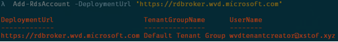
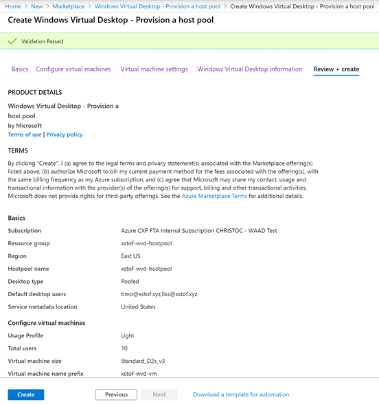

# Notes on setup of WVD

## Create WVD Tenant

### Prepare consent and user permissions to create WVD tenant

- need AAD Global Admin account
- grant permissions to WVD **Server App**; this needs admin consent: https://login.microsoftonline.com/common/adminconsent?client_id=5a0aa725-4958-4b0c-80a9-34562e23f3b7&redirect_uri=https%3A%2F%2Frdweb.wvd.microsoft.com%2FRDWeb%2FConsentCallback

- grant permissions to WVD **Client App**; also needs admin consent: https://login.microsoftonline.com/common/adminconsent?client_id=fa4345a4-a730-4230-84a8-7d9651b86739&redirect_uri=https%3A%2F%2Frdweb.wvd.microsoft.com%2FRDWeb%2FConsentCallback

- assign the `Tenant Creator` app role to a user, allowing him to create a WVD tenant (in my environment: `wvdtenantcreator@xstof.xyz`)
  - go into "Enterprise Applications" - "Windows Virtual Desktop" - "Users and Groups" - "Add User" - "Add Assignment" - "TenantCreator" (there is currently only one role to assign, so cannot really choose here even)

### Create the WVD Tenant

- Import the WVD PowerShell module: https://docs.microsoft.com/en-us/powershell/windows-virtual-desktop/overview/ 

> Note: this is NOT build on .NET core, so cannot run on Mac, Linux, Cloud Shell or PS Core

~~~powershell
Install-Module -Name Microsoft.RDInfra.RDPowerShell
Import-Module -Name Microsoft.RDInfra.RDPowerShell

# If needed, can update the module using:
# Update-Module -Name Microsoft.RDInfra.RDPowerShell
~~~
- Sign in to WVD using the TenantCreator account:

~~~powershell
Add-RdsAccount -DeploymentUrl "https://rdbroker.wvd.microsoft.com"
~~~

- Create a new WVD tenant and associate with AAD tenant

~~~powershell
$wvdtenantname = "xstof-wvd"
$aadtenantid = "3fd11e85-d8ce-4c7f-b6a0-816346615777"
$subscriptionid = "eb2cf854-8c12-4583-97bf-43bf12f1a688"

New-RdsTenant -Name $wvdtenantname -AadTenantId $aadtenantid -AzureSubscriptionId $subscriptionid
~~~

- Optionally you can assign tenant admin access to the tenant to another user:

~~~powershell
New-RdsRoleAssignment -TenantName $wvdtenantname -SignInName wvdrdsowner@xstof.xyz -RoleDefinitionName "RDS Owner"
~~~

> Note: this does not seem to result in any AAD role assignments

## Create Host Pool

### Create Service Principal with rights to deploy a Host Pool

- Install and Import AzureAD PowerShell module:

~~~powershell
Install-Module AzureAD
Import-Module AzureAD
~~~

- Create the Service Principal in AAD:

~~~powershell
$aadContext = Connect-AzureAD 
# => sign-in here with tenant creator user

$svcPrincipal = New-AzureADApplication -AvailableToOtherTenants $true -DisplayName "Windows Virtual Desktop Svc Principal"

# Fetch credentials from this Service Principal:
$svcPrincipalCreds = New-AzureADApplicationPasswordCredential -ObjectId $svcPrincipal.ObjectId
~~~

> **Note**: In addition to just creating the app registration for this in AAD, also make sure to create a corresponding Service Principal and give it contributor rights on the hostpool Resource Group - this will later be required to update the hostpool when for example re-imaging the VM's using the update ARM template

- Now write down those credentials:

~~~powershell
$sppassword = $svcPrincipalCreds.Value   # => gives the password
$aadtenantid = $aadContext.TenantId.Guid # => gives the normal AAD tenant id (3fd11e85-d8ce-4c7f-b6a0-816346615777)
$spappid = $svcPrincipal.AppId           # => gives the app id (43b2ddf9-7a61-47ec-b43b-a445b26d83c9)
~~~

- Create WVD role assignments: we need the Service Principal to be able to sign into WVD andfor this we need to assign it a proper WVD role

~~~powershell
Add-RdsAccount -DeploymentUrl "https://rdbroker.wvd.microsoft.com"
Get-RdsTenant

New-RdsRoleAssignment -RoleDefinitionName "RDS Owner" -ApplicationId $spappid -TenantName $wvdtenantname
~~~

- Then make sure you can sign in with the SP by running:

~~~powershell
$creds = New-Object System.Management.Automation.PSCredential($svcPrincipal.AppId, (ConvertTo-SecureString $svcPrincipalCreds.Value -AsPlainText -Force))
Add-RdsAccount -DeploymentUrl "https://rdbroker.wvd.microsoft.com" -Credential $creds -ServicePrincipal -AadTenantId $aadtenantid
~~~

Now we can use this Service Princpal to create a host pool in WVD

### Option 1 - Deploy Host Pool through the Azure portal

- Add a resource from marketplace called "Windows Virtual Desktop - Provision a host pool".  Click `Create`.

You should find that:
- VM's are domain joined after the template deployment

> **Attention Points**
> - VM's in hostpool need to be able to contact DNS to find the AD DC to domain join with
> - the account which with the domain join happens will become local account on the VM, so you can log in with that account and pwd
> - the VM's don't have RDP port 3389 open and should not have that open - not needed

### Option 2 - Deploy Host Pool through an ARM template

There's an ARM template to deploy the host pool, available here: https://github.com/Azure/RDS-Templates/tree/master/wvd-templates/Create%20and%20provision%20WVD%20host%20pool

### Add users to the Desktop Application Group

Now we can add additional users to the "Desktop Application Group"

~~~powershell
Add-RdsAccount -DeploymentUrl "https://rdbroker.wvd.microsoft.com"
Add-RdsAppGroupUser -TenantName <wvd-tenant-name> -HostPoolName <host-pool-name> -AppGroupName "Desktop Application Group" -UserPrincipalName <user-to-add>
~~~

### Test logging in

As of now we can login with a test user.  We can do this:
- Web Based: http://aka.ms/wvdweb
- Desktop Client (Windows 64 bit): https://go.microsoft.com/fwlink/?linkid=2068602 

## Manage App Groups

### Create an App Group

To view the default app group:

We can create another app group to publish individual applications:

~~~powershell
Add-RdsAccount -DeploymentUrl "https://rdbroker.wvd.microsoft.com"
New-RdsAppGroup -TenantName <tenantname> -HostPoolName <hostpoolname> -Name <appgroupname> -ResourceType "RemoteApp"
# Can get the group at any time like this:
# Get-RdsAppGroup -TenantName <tenantname> -HostPoolName <hostpoolname>
~~~

Now figure out which apps are on the Start menu in our host pool VM.  The info we'll need are:
- FilePath
- IconPath
- IconIndex
- AppAlias

~~~powershell
Get-RdsStartMenuApp -TenantName <tenantname> -HostPoolName <hostpoolname> -AppGroupName <appgroupname> | ft FriendlyName,AppAlias,FilePath,IconPath,IconIndex
~~~

Let's create a new app in the app group based on the alias:

~~~powershell
New-RdsRemoteApp -TenantName <tenantname> -HostPoolName <hostpoolname> -AppGroupName <appgroupname> -Name <remoteappname> -AppAlias <appalias>
~~~

Then add access to one or more users to this app group:

~~~powershell
Add-RdsAppGroupUser -TenantName <tenantname> -HostPoolName <hostpoolname> -AppGroupName <appgroupname> -UserPrincipalName <user-to-assign-access>
~~~

> **In order to delete a hostpool:**
> - delete the resources in Azure
> - delete the app group
> - delete the session hosts in the hostpool
> - delete the hostpool

## Working with Profile Containers and FSLogix

Can store these on:
- File Server
- Azure Files
- NetApp Files

### Create Share - Option 1: VM File Share

Created a file server, joined the domain, created a file share (`\\XSTOF-AD-SHARE\ProfileShare`), gave permissions to the wvd users groups in AD.  For permissions required on the share, see here: https://docs.microsoft.com/en-us/fslogix/fslogix-storage-config-ht

### Create Share - Option 2: Azure Files

See: https://docs.microsoft.com/en-us/azure/storage/files/storage-files-identity-auth-active-directory-domain-service-enable

We need to enable the integration with both AAD and AD for enforcing and being able to use standard ACLs.  See here: https://docs.microsoft.com/en-us/azure/storage/files/storage-files-identity-auth-active-directory-enable

- Download the Azure Files Hybrid zip: https://github.com/Azure-Samples/azure-files-samples/releases
- Follow the instructions in the article - however, when running this from a Server 2016 DC, you might hit this error:

You can get around this by first executing: `[Net.ServicePointManager]::SecurityProtocol = [Net.SecurityProtocolType]::Tls12`

Also make sure to install the Az Cmdlets: `Install-Module -Name Az -AllowClobber`

This will result into a user being created in the designated Organizational Unit:

We can now assign AAD RBAC on the Azure Files share, for example through the portal:

For more information on permissions, see here: https://docs.microsoft.com/en-us/azure/storage/files/storage-files-identity-auth-active-directory-enable#assign-access-permissions-to-an-identity

Now we need to assign NTFS permissions on the share, directory and file level.  To do this, we mount the File Share with the storage account key and configure the permissions:

~~~
net use <desired-drive-letter>: \\<storage-account-name>.file.core.windows.net\<share-name> <storage-account-key> /user:Azure\<storage-account-name>
~~~

We can check if AD integration for File Share has been enabled:

Then configure the NTFS permission from within Windows.

As of this point we should be able to mount the File Share like this:

~~~powershell
net use Z: \\xstofwvdfiles.file.core.windows.net\profileshare
~~~

### Configure FSLogix Profile container

Log in to VM from host pool, download FSLogix agent from here: https://go.microsoft.com/fwlink/?linkid=2084562

#### Configure Reg Keys for enabling FSLogix - Option 1: Manual on the VM

In order to enable FSLogix, we need a reg key:
- go into `Computer\HKEY_LOCAL_MACHINE\software\FSLogix`
- create key `Profiles`
- create value in there:
  - Enabled - DWORD - 1
  - VHDLocations - MultiString Value - "\\XSTOF-AD-SHARE\ProfileShare"
  - optional: DeleteLocalProfileWhenVHDShouldApply - DWORD - 1

#### Configure Reg Keys for enabling FSLogix - Option 2: using Group Policies on AD

Better, more flexible is to have those reg keys be pushed to all session hosts automatically through a Group Policy.  To do so:
- Create an OU (Organizational Unit) in which to place your session hosts.  (Which OU the session host joins when joining the AD domain, you can configure during the hostpool setup / ARM template.)
- Configure a Group Policy on that OU:
  - In the installation folder for FSLogix (when it was downloaded and unzipped) there' both an `adml` and `admx` file

  

  - Go the the SYSVOL folder for the domain (which is a share on the DC controller which is replicated) and in the folder called `Policies` create another folder called `PolicyDefinitions`.  Then move the `fslogix.admx` file there.  In addition create a folder `en-us` under which you move the `fslogix.adml` file.

  

  - Then go into the AD domain controller and open `gpmc.msc`
  - Go into the OU, right click and select `Create a GPO in this domain and Link it here`

  

  - Give the GPO a name and configure it:
    - Enabled => Yes
    - VHD Location => point to your fileshare (`\\XSTOF-AD-SHARE\ProfileShare`)

  

### Check which files / dirs are redirected

When FSLogix is installed on our session host, we can check which folders are redirected.  We can do so by opening up a command window and going into `C:\Program Files\FSLogix\Apps` where the FSLogix `frx` command can be used.

To see which folders are redirected: `frx list-redirects`

## Creating a packer-based WVD image

See [`./wvd-image-creation/README.md`](./wvd-image-creation/README.MD)

## Update Host Pool

Updating the host pool can be done based on this template: https://github.com/Azure/RDS-Templates/blob/master/wvd-templates/Update%20existing%20WVD%20host%20pool/mainTemplate.json

For this to work:
- you need to have a service principal (see earlier) which has contributor rights on the hostpool resource group
- you need to specify a different sessionhost prefix than you chose before when you last deployed the hostpool
