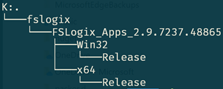
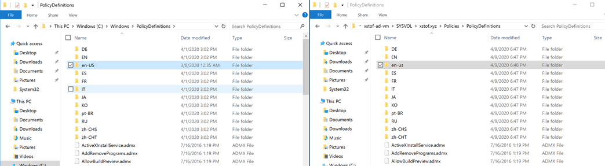
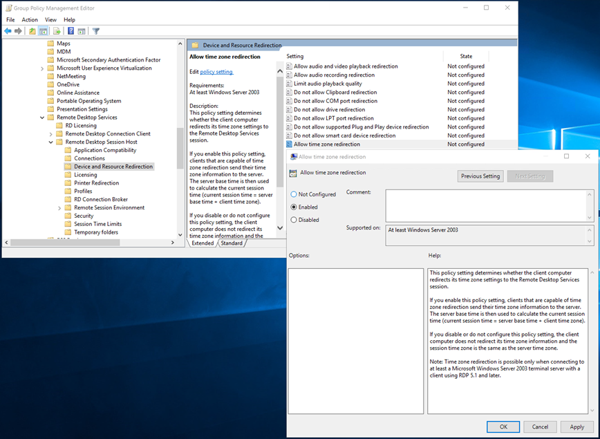

# Working with Packer

Also see: https://docs.microsoft.com/en-us/azure/virtual-machines/windows/build-image-with-packer

## Installing Packer and dependencies

### Install Packer 
https://packer.io/downloads.html

### Install the Windows Update Provisioner
https://github.com/rgl/packer-provisioner-windows-update/releases

Put the executable in the same location as your `packer.exe`

## Create Packer Script

See example of script: [`./sessionhost.json`](./sessionhost.json)

This script assumes the presence of an Azure Files share with the artifacts it needs.  In our case, the FSLogix agent artifacts are stored on this fileshare, as follows:

As the example script is in flux, _only_ the following two variables are actually being used: `wvdbuildartifacts_path`, `wvdbuildartifacts_storageaccountkey`.

## Execute Packer and create image:

~~~powershell
# set environment variables
$env:wvdbuildartifactspath = "\\xstofwvdbuildartifacts.file.core.windows.net\wvdbuildartifacts"
$env:wvdbuildartifactskey = "m3aADPBLnMZ6P3vQJPjy6P...DTo2Gvhu40DjDvwg=="

# execute packer
packer build -force .\sessionhost.json
~~~

## Setup Group Policies relevant to WVD:

### Add adminstrative templates

First we need to add administrative templates so they show up in `gpmc.msc`.  To do this, copy all files from `C:\Windows\PolicyDefinitions` to `\\dccomputername\SYSVOL\yourdomain.tld\Policies\PolicyDefinitions`

### Timezone Redirection

This setting allows the user to work in the same timezone as their own local machine.

## Things to include in image

Connection Experience indicator: 
- https://bramwolfs.com/2020/03/11/connection-experience-indicator-for-rds-wvd/ - no installation, just exe which can be run on startup
- 

